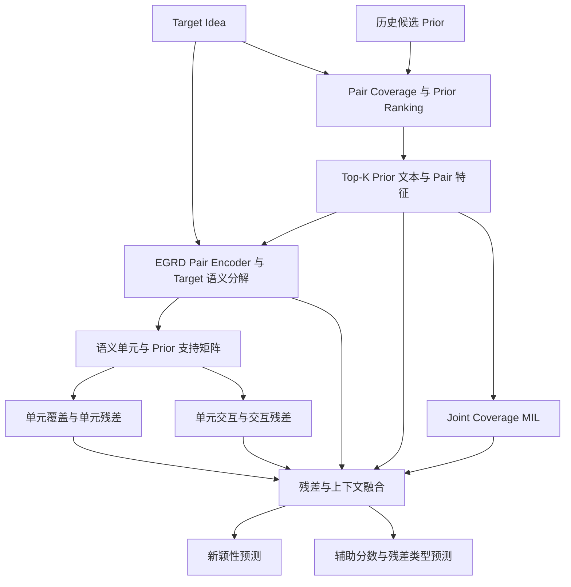

# ICLR 2027：以 EGRD 方法为核心的论文架构

更新：2026-09-11。本版重新组织论文叙事与章节，不改变模型实现。实验数值、历史版本差别和补实验事项仍见内部工作文档 [实验依据与补实验计划](实验依据与补实验计划.md)；该文档不作为正文目录。

## 1. 整篇论文讲什么

**通过识别历史研究已经覆盖的内容，并建模剩余内容及其交互，评估科研 Idea 的新颖性。**

全文围绕一条逻辑展开：

> 历史工作覆盖了什么 → Target 还剩什么 → 剩余部分及其组合有何实质意义 → 整体新颖性如何。

论文核心是 EGRD（Evidence-Grounded Residual Decomposition）。历史证据选择与联合覆盖提供比较依据；语义分解及两类残差刻画剩余贡献；最终预测综合这些信息，形成新颖性判断。

`evidence-conditioned` 在任务定义中用一句话说明即可：模型评估的是 Target 相对于给定历史 Prior 集合的新颖性。后续通过支持矩阵、覆盖聚合和证据干预体现这一属性，无须反复强调术语。

标题建议：

**What Remains New? Evidence-Grounded Residual Decomposition for Scientific Idea Novelty Assessment**

更直接的版本：

**EGRD: Learning Semantic Residuals for Scientific Idea Novelty Assessment**

## 2. 研究动机：三个问题递进

| 问题 | 困难 | 对应设计 |
|---|---|---|
| 历史研究共同覆盖了什么？ | 一个 Idea 的不同部分可能分散在多篇已有工作中，单篇相似性不足以描述整体覆盖 | Pair Coverage 与 Joint Coverage |
| 未被覆盖的究竟是哪一部分？ | 总体覆盖分数不能区分剩余的是微小改动还是关键机制 | 潜在语义分解与单元残差 |
| 已知成分之间是否形成新交互？ | 两个成分都已经出现，也可能存在具有实质差异的结合方式 | 交互残差与实质性预测 |

Introduction 可以用一个贯穿全文的例子：P1 提出了机制 A，P2 使用了训练信号 B，Target 将 A 与 B 结合。需要判断 A、B 的历史覆盖，也需要判断结合方式是否有实质差异。

这里的 A/B 是动机示意，正文最终应使用经核验的真实案例。“缺少共同历史支持”本身不能直接证明存在实质创新。

## 3. 模型架构：三个区域、五个模块

架构图分成“历史覆盖”“残差建模”“新颖性预测”三个区域。

这是现有流程的模块概览，省略各辅助头的内部连接。不同阶段分别训练，梯度不跨阶段传播；箭头表示信息传递。

Methods 按下面五个小节展开。

### 4.1 Historical Evidence Modeling：历史证据建模

**回答：哪些 Prior 为 Target 提供覆盖证据，多篇 Prior 联合覆盖到什么程度？**

对 Target–Prior 联合编码，预测 Pair Coverage；按覆盖强度排序，保留 Top-K；通过 Joint Coverage MIL 聚合多篇历史证据。当前常用 K=5。

这一节为 EGRD 提供输入，正文简述设计和输出即可。Pair 分层概率、排序 bonus、MIL 统计特征等实现细节放附录。

### 4.2 Latent Semantic Decomposition：潜在语义分解

**回答：Target 包含哪些可与历史证据对齐的语义成分？**

EGRD 对 Target 与选定 Prior 分别编码，汇集 Target token 表示，再通过 M 个可学习查询生成语义单元：

\[
u_m=\sum_n\alpha_{mn}h_n,\qquad m=1,\ldots,M.
\]

其中 \(h_n\) 是 Target token 表示，\(\alpha_{mn}\) 是单元 m 对 token n 的注意力权重。当前常用 M=8。

解释槽位竞争及分解约束的作用：让不同单元关注不同内容。具体采用 `legacy` 还是 `sparsemax` 按最终实验配置确定。单元是潜在表示，不预先命名为固定的“任务槽”或“机制槽”。

### 4.3 Evidence-Aligned Unit Residuals：证据对齐的单元残差

**回答：哪些语义成分已有历史支持，哪些仍未被覆盖？**

学习 Prior k 对单元 m 的支持强度 \(a_{km}\)，形成 \(K\times M\) 支持矩阵，计算覆盖与残差：

\[
c_m=1-\prod_k(1-a_{km}),\qquad r_m=v_m(1-c_m).
\]

其中 \(v_m\) 是单元活跃度。以 \(r_m\) 加权汇总单元，形成残差表示；同时保留已覆盖内容的表示。

这一节是方法核心：剩余贡献由具体历史支持关系决定。Noisy-OR 是可微聚合方式，预测是否符合实际覆盖需要实验验证。

### 4.4 Interaction Residual Modeling：交互残差建模

**回答：单元本身已知时，它们之间是否仍存在未被覆盖的交互？**

构建单元对 \((u_i,u_j)\) 的交互表示。当前代码使用同一 Prior 对两个单元支持强度的乘积，近似共同历史支持：

\[
b_{ij}=\max_k(a_{ki}a_{kj}),\qquad r_{ij}=g(u_i,u_j)(1-b_{ij}).
\]

其中 \(g\) 是学习得到的交互强度。按交互残差聚合交互表示，补充单元残差不能表达的信息。

共同支持是近似信号，不能直接证明历史论文已经覆盖目标中的特定组合。需要无交互消融及组合案例核验。

### 4.5 Novelty Prediction and Learning：新颖性预测与学习

**回答：剩下的内容有多大实质意义，整体应判为哪一级新颖性？**

融合单元残差、交互残差、覆盖表示及全局上下文，预测新颖性等级，并结合实质差异、残差类型等辅助目标训练。

正文写清主输出、主要训练目标和分阶段训练方式；完整损失权重、细分类别、阈值与各预测头融合细节放附录。最终实验使用哪一种输出，全文保持一致。

方法叙事由此闭合：**历史支持关系 → 两类残差表示 → 残余贡献的实质性与新颖性预测。**

## 4. 全文目录

初稿不设页数预算，各章先写全，压缩留到定稿阶段。

| 章节 | 内容重点 |
|---|---|
| 1. Introduction | 三个递进问题、动机例子、方法直觉和贡献 |
| 2. Related Work | 科研新颖性评估、文献证据建模、语义分解 |
| 3. Problem Formulation | 输入、输出、时间约束与证据条件 |
| 4. Dataset | 证据配对语料的构建、规模、划分与标签来源 |
| 5. Method: EGRD | 上述五个模块，重点为语义分解和两类残差 |
| 6. Experiments | 设置、主结果、消融、证据作用、证据预算、泛化和案例 |
| 7. Conclusion and Limitations | 方法结论、适用范围和当前不足 |

Pair 分层概率、排序 bonus 与各辅助头细节移入附录，这是内容归属的判断，与篇幅无关。

### Introduction：五段叙事

1. 科研 Idea 新颖性判断的需求，以及对已有研究背景的依赖。
2. 多篇历史工作的分散覆盖，使单篇相似性比较不足以描述整体已有贡献。
3. 总体覆盖无法区分剩余内容的性质，已知成分的新交互也可能被遗漏；由此引出残差分解。
4. 概述 EGRD：历史覆盖、语义分解、两类残差及新颖性预测。
5. 列出贡献并概括经验证的结果。实验未完成前不预写显著性或全面领先。

### Problem Formulation：只定义任务

给定 Target Idea \(x\) 和时间合法的历史证据集合 \(\mathcal P_x\)，模型输出：

\[
\hat y=f_\theta(x,\mathcal P_x),\qquad
\hat y\in\{\mathrm{low},\mathrm{weak},\mathrm{moderate},\mathrm{high}\}.
\]

简要定义相关性、覆盖和残差的区别，说明判断针对所提供的证据集合。连续分数和辅助任务在方法中介绍。

这里不展开数据构建流程，也不将标签生成公式写成任务定义。

### Dataset：证据配对语料

正文设独立小节说明这份语料，全文称其为 dataset 或 corpus，**不使用 benchmark 一词**。理由是标签由模型规则生成，人工核验尚未完成；benchmark 意味着承诺它可作为评判标准，当前证据不支持这一承诺。

需要写进正文的内容：

- 覆盖 Graph ML、CV、Time Series 三个领域，Idea 级与 Target–Prior 配对级两层规模，以及时间合法性约束的定义。
- 划分方式与去重、来源论文隔离；说明上游 Pair/MIL 训练均排除下游 test target。
- 标签来源如实写为模型生成（model-generated labels），并说明 Graph 与 CV/TS 的标注模型不同，跨域比较需区分标注协议差异。
- 与只提供 Idea 和单一分数的已有资源相比，本语料带有时间合法的证据配对，因而支持证据干预类实验。这是资源部分的主要价值，不以规模为卖点。

构建流程细节、提示词、去重检查与统计表放附录 B。人工核验若在截稿前完成，在此处补充一致性指标与人工-模型标签吻合度；未完成则不写，也不改用 benchmark 措辞。

### Experiments：按方法主张组织

| 小节 | 研究问题 | 必要内容 |
|---|---|---|
| 5.1 Experimental Setup | 如何验证方法？ | 数据与划分、来源简述、基线、训练及校准设置、指标 |
| 5.2 Overall Performance | EGRD 整体是否有效？ | 同测试集主表，包含同骨干直接预测和已有外部基线 |
| 5.3 Component Analysis | 分解和残差设计是否贡献收益？ | 单单元、无交互、无槽位竞争、无类型监督等配对消融 |
| 5.4 Effect of Historical Evidence | 模型是否有效利用历史证据？ | Target-only、Prior-only、随机/删除证据及证据数量影响 |
| 5.5 Evidence Budget and Aggregation | 扩大证据量能否不重训地被利用？ | K=5、K=25 与分块保守聚合对照；聚合规则在开发集选定；重复与无关证据的压低检查；真实开销记录 |
| 5.6 Generalization | 换评测环境后是否仍有效？ | RINoBench；多领域实验完成后加入；不同适配协议分开 |
| 5.7 Case Study and Failure Analysis | 模型关注什么、在哪些情况失效？ | 支持矩阵、单元残差、组合案例与高新颖度误判 |

5.5 是第 4 条贡献的落点，因此进正文而非附录；同预算校准对照进主表，切点搜索与逐规则扫描放附录。实验服务于核心机制，待完成实验不能提前写成结果。

### Limitations：先写全，再压缩

初稿阶段不控制篇幅，把下列限制全部写出来，正文与附录的分配等定稿时再定。排序原则是审稿人自己能发现的先说，只声明范围，不做辩解。

- 标签由模型生成，全部评测衡量的是与一套模型规则的吻合度，而非与人类判断的吻合度；人工核验完成前不声称接近人类水平。
- 高新颖度档位是主要弱点，方法在最需要判别力的地方最弱，该档的召回与 F1 须自己写出来。
- 跨标注体系的迁移尚未解决，适配后序数头在外部测试集出现单一类别塌缩；据此把主张范围收窄到「给定证据集合的域内新颖性分解」。
- 交互残差的共同支持是近似信号，不等于历史论文真的覆盖了目标中的该组合。
- 跨块保守聚合是启发式，不是跨块语义单元联合支持的精确合并；无关或重复证据会造成过度压低。
- 证据集合是固定候选池，检索指标在该池上评估，不是对完整文献世界的召回；新颖性按定义相对于所提供的证据。
- 支持矩阵是模型响应，在删除高支持 Prior 的干预完成前不宣称解释具有因果忠实性。
- 领域仅覆盖三个机器学习子方向，且 Graph 与 CV/TS 标注模型不同，跨域差异不能全部归因于知识迁移。
- 第 4 条贡献与迁移结果存在张力：外部集上的较好数字来自分块聚合，而同一模型直接推理明显更低。若分块聚合主要在补救迁移失败而非提升能力，须在此点破，不能让两处数字互相矛盾地并存。

避免的写法：不写成「未来工作会解决」的清单；不用计算资源受限当借口，标签与迁移问题与算力无关；负面结果在实验章该出现的就出现，本节只做范围声明，不第一次披露。

## 5. 贡献怎么写

围绕四项组织，定稿时按实验支持程度调整措辞：

1. **Evidence-conditioned residual formulation.** 将新颖性判断由整体相似度重述为「先定位历史证据的联合覆盖，再对残余贡献定价」，并给出相对于时间合法证据集合的任务定义。
2. **A multi-domain, evidence-paired dataset.** 发布覆盖三个领域的 Idea 级与 Target–Prior 配对级语料，带时间合法性约束，使证据条件下的评估与证据干预实验成为可能。标签为模型生成，措辞用 dataset，不用 benchmark。
3. **Unit and interaction residual modeling.** 设计语义单元与历史支持对齐机制，联合表示未覆盖成分和潜在的新交互；交互项基于共同支持的近似信号，正文明确其局限。
4. **Budget-scalable conservative evidence aggregation.** 提出一种推理期证据扩展方案：模型以 K=5 训练，推理时将更大的证据集合切成多个小块分别编码，再以保守规则跨块聚合，无须重训即可消费数倍证据。

第 1、3、4 项是方法主张，第 2 项是资源主张。动词用 we formulate / we release / we propose。四条 bullet 均不带具体数值，主表数字只出现在 Introduction 末段与 Abstract，以免冻结版本或主输出变更时全文连动。

第 4 条的写作口径：

- 称为**保守聚合启发式**，不写成单元级 Noisy-OR 的等价实现。各块独立编码、独立生成槽位，不同块可能分别覆盖不同单元，标量 min 无法精确合并全部单元覆盖。
- 聚合规则与切点使用了外部集的 train 划分，因此**不是严格零样本**，须与纯零样本行分区报告。
- 与基线比较必须同证据预算、同校准数据；不同预算或不同校准协议的数字不并列。
- 需检查无关或重复证据造成的过度压低，这是保守聚合的固有风险。
- 记录真实消耗的文本量、调用量与延迟，不把 API 排队差异写成架构速度倍数。

Introduction 第五段并列四条易读成流水账，建议将第 1、2 项合成一句：提出新的任务定义，并提供使其可测的语料。图谱的具体作用在输入证据或实现细节中说明，不单列为贡献。

## 6. 主文图表安排

| 图表 | 内容 | 服务的主张 |
|---|---|---|
| Figure 1 | 动机例子与 EGRD 整体架构，可做上下两部分 | 为什么需要覆盖、单元残差与交互残差 |
| Table 1 | 主结果与关键基线 | 整体有效性 |
| Table 2 | 同版本、配对 seed 的核心消融 | 模块贡献 |
| Figure 2 | 关键证据删除/替换后的预测变化 | 证据是否被有效利用 |
| Table 3 | 外部评测及完成后的分域结果 | 泛化与适配边界 |
| Figure 3 | 真实案例中的支持矩阵及两类残差 | 模型行为与失败原因 |

主表建议同时列 Macro-F1、QWK、MAE 和 High-F1，完整混淆矩阵放附录。热力图展示模型响应，其忠实性需要干预实验支撑。

## 7. 数据与复现信息放在哪里

数据来源、标签来源、规模与划分由独立的 Dataset 小节承担；Experimental Setup 只说明本文实验如何使用这份数据，不重复统计表。两处都不使用“金标/银标”的分类名称，直接写标签由模型生成。不同来源的标签如有区别，按实际情况简要说明。

附录集中放数据处理和标注细节、提示词、划分与去重检查、超参数、完整损失和额外实验。正文围绕任务、模型和验证展开，读者需要复现时再查对应附录。

建议附录目录：

- A. Implementation and Training Details
- B. Data Sources and Processing Details
- C. Additional Results and Robustness Analysis
- D. Additional Case Studies

下一步写作可以从 **Introduction 的前三段和 Method 的 4.2–4.4** 开始：先讲清“为什么需要两类残差、它们如何计算”，再据冻结结果填入实验和摘要。
